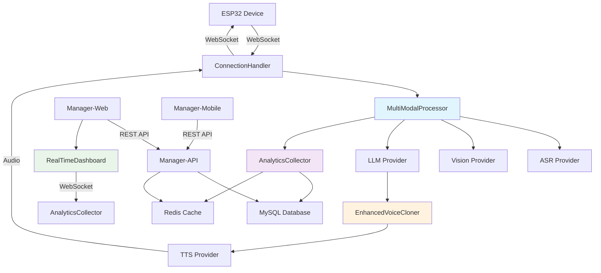

# Xiaozhi-ESP32-Server Brownfield Enhancement Architecture

## Introduction

This document outlines the architectural approach for enhancing xiaozhi-esp32-server with advanced AI capabilities including multi-modal processing, real-time analytics, enhanced voice cloning, and improved scalability. Its primary goal is to serve as the guiding architectural blueprint for AI-driven development of new features while ensuring seamless integration with the existing system.

**Relationship to Existing Architecture:**
This document supplements existing project architecture by defining how new components will integrate with current systems. Where conflicts arise between new and existing patterns, this document provides guidance on maintaining consistency while implementing enhancements.

### Existing Project Analysis

#### Current Project State

- **Primary Purpose:** Distributed voice AI platform for ESP32 devices with WebSocket communication, AI service integration, and management interfaces
- **Current Tech Stack:** Python 3.x (asyncio, websockets), Java 21 (Spring Boot 3.4.3), Vue.js 2.x, uni-app v3, MySQL, Redis
- **Architecture Style:** Microservices with provider pattern for AI services, REST API for management, WebSocket for real-time communication
- **Deployment Method:** Docker Compose with individual service containers

#### Available Documentation

- Brownfield architecture analysis from document-project output
- Technical documentation in `docs/` folder (Chinese)
- API documentation via Knife4j at `/xiaozhi/doc.html`
- Configuration documentation in `config.yaml` and `application.yml`

#### Identified Constraints

- Mixed language architecture (Python + Java + Vue.js + uni-app) creates deployment complexity
- WebSocket connection handling creates new handler instances per connection
- AI service provider interfaces are inconsistent across different providers
- Configuration management spans multiple files and formats
- Limited test coverage across all components

### Change Log

| Change | Date | Version | Description | Author |
|--------|------|---------|-------------|---------|
| Initial Architecture | 2025-01-27 | 1.0 | Created comprehensive enhancement architecture | BMad Master |

## Enhancement Scope and Integration Strategy

### Enhancement Overview

**Enhancement Type:** Advanced AI Capabilities Enhancement
**Scope:** Multi-modal processing, real-time analytics, enhanced voice cloning, scalability improvements
**Integration Impact:** Significant - requires coordinated changes across all four components while maintaining backward compatibility

### Integration Approach

**Code Integration Strategy:** Extend existing provider pattern for AI services, add new components following established architectural patterns
**Database Integration:** Add new tables for analytics and enhanced configuration while maintaining existing schema compatibility
**API Integration:** Extend existing REST API endpoints in manager-api with new analytics and configuration endpoints
**UI Integration:** Add new Vue.js components to manager-web following existing Element UI patterns

### Compatibility Requirements

- **Existing API Compatibility:** All current REST API endpoints must remain unchanged
- **Database Schema Compatibility:** New tables will be added but existing data structures must remain unchanged
- **UI/UX Consistency:** New dashboard features must follow existing Element UI design patterns
- **Performance Impact:** System must maintain existing performance characteristics with no more than 30% memory increase

## Tech Stack

### Existing Technology Stack

| Category | Current Technology | Version | Usage in Enhancement | Notes |
|----------|-------------------|---------|----------------------|-------|
| AI Server | Python | 3.x | Core AI processing | Maintain existing asyncio patterns |
| AI Server | asyncio | - | Async programming | Extend for multi-modal processing |
| AI Server | websockets | 14.2 | ESP32 communication | Maintain WebSocket protocol |
| AI Server | torch | 2.2.2 | ML/AI models | Extend for enhanced capabilities |
| AI Server | funasr | 1.2.3 | Speech recognition | Enhance with multi-modal support |
| AI Server | openai | 2.5.0 | AI API client | Extend for advanced features |
| Backend | Java | 21 | REST API | Maintain Spring Boot patterns |
| Backend | Spring Boot | 3.4.3 | API framework | Extend with new endpoints |
| Backend | MyBatis-Plus | 3.5.5 | ORM framework | Add new entity mappings |
| Backend | MySQL | - | Primary database | Add new tables for analytics |
| Backend | Redis | - | Caching layer | Extend for performance optimization |
| Frontend | Vue.js | 2.x | Web UI | Maintain existing component patterns |
| Frontend | Element UI | - | UI components | Extend with new dashboard components |
| Frontend | Vuex | - | State management | Extend for analytics data |
| Mobile | uni-app | v3 | Cross-platform | Maintain existing patterns |

### New Technology Additions

| Technology | Version | Purpose | Rationale | Integration Method |
|------------|---------|---------|-----------|-------------------|
| OpenCV | 4.x | Computer vision processing | Multi-modal vision capabilities | Python package integration |
| TensorFlow | 2.x | Enhanced ML models | Advanced voice cloning | Provider pattern extension |
| WebRTC | - | Real-time communication | Enhanced WebSocket capabilities | JavaScript integration |
| Chart.js | 3.x | Analytics visualization | Real-time dashboard charts | Vue.js component integration |

## Data Models and Schema Changes

### New Data Models

#### AnalyticsData
**Purpose:** Store real-time analytics and performance metrics for system monitoring
**Integration:** Extends existing device and model configuration tables

**Key Attributes:**
- id: BIGINT - Primary key
- device_id: VARCHAR(255) - Reference to existing device table
- metric_type: VARCHAR(100) - Type of metric (performance, usage, error)
- metric_value: DECIMAL(10,4) - Numeric metric value
- timestamp: TIMESTAMP - When metric was recorded
- metadata: JSON - Additional metric context

**Relationships:**
- **With Existing:** Links to device table via device_id
- **With New:** Parent table for detailed analytics records

#### VoiceProfile
**Purpose:** Store enhanced voice cloning profiles and training data
**Integration:** Extends existing model configuration system

**Key Attributes:**
- id: BIGINT - Primary key
- profile_name: VARCHAR(255) - User-defined profile name
- voice_data: LONGBLOB - Binary voice training data
- quality_score: DECIMAL(3,2) - Voice quality rating
- created_at: TIMESTAMP - Profile creation time
- user_id: BIGINT - Reference to user who created profile

**Relationships:**
- **With Existing:** Links to user table and model configuration
- **With New:** Referenced by TTS provider configurations

#### MultiModalSession
**Purpose:** Track multi-modal processing sessions and context
**Integration:** Extends existing session management

**Key Attributes:**
- id: BIGINT - Primary key
- session_id: VARCHAR(255) - WebSocket session identifier
- input_types: JSON - Array of input types (voice, vision, text)
- processing_pipeline: JSON - AI service processing sequence
- context_data: JSON - Multi-modal context information
- created_at: TIMESTAMP - Session start time

**Relationships:**
- **With Existing:** Links to WebSocket connection sessions
- **With New:** Parent table for multi-modal processing records

### Schema Integration Strategy

**Database Changes Required:**
- **New Tables:** analytics_data, voice_profiles, multi_modal_sessions, performance_metrics
- **Modified Tables:** model_config (add multi_modal_support column), device (add analytics_enabled column)
- **New Indexes:** device_id + timestamp on analytics_data, session_id on multi_modal_sessions
- **Migration Strategy:** Use Liquibase for additive schema changes, maintain backward compatibility

**Backward Compatibility:**
- All existing tables remain unchanged
- New columns are nullable with default values
- Existing queries continue to work without modification

## Component Architecture

### New Components

#### MultiModalProcessor
**Responsibility:** Process and fuse multi-modal inputs (voice, vision, text) into unified context
**Integration Points:** Extends existing provider pattern, integrates with WebSocket message handling

**Key Interfaces:**
- process_multimodal_input(session_id, inputs) -> unified_context
- register_input_handler(input_type, handler_function)
- get_processing_pipeline(session_id) -> pipeline_config

**Dependencies:**
- **Existing Components:** ConnectionHandler, AI service providers
- **New Components:** AnalyticsCollector, ContextManager

**Technology Stack:** Python asyncio, OpenCV for vision processing, existing provider interfaces

#### AnalyticsCollector
**Responsibility:** Collect and aggregate real-time performance and usage metrics
**Integration Points:** Integrates with all AI service providers, stores data in new analytics tables

**Key Interfaces:**
- collect_metric(metric_type, value, metadata)
- get_performance_summary(time_range) -> metrics_summary
- export_analytics_data(format, filters) -> data_export

**Dependencies:**
- **Existing Components:** All AI service providers, database connection
- **New Components:** AnalyticsDashboard, PerformanceMonitor

**Technology Stack:** Python asyncio, Redis for caching, MySQL for persistence

#### EnhancedVoiceCloner
**Responsibility:** Provide advanced voice cloning capabilities with improved quality
**Integration Points:** Extends existing TTS provider system, integrates with voice profile management

**Key Interfaces:**
- train_voice_profile(audio_data, parameters) -> profile_id
- synthesize_voice(text, profile_id) -> audio_output
- evaluate_voice_quality(profile_id) -> quality_score

**Dependencies:**
- **Existing Components:** TTS provider base class, model configuration system
- **New Components:** VoiceProfileManager, QualityAssessor

**Technology Stack:** TensorFlow for ML models, existing TTS provider architecture

#### RealTimeDashboard
**Responsibility:** Provide real-time analytics visualization and system monitoring
**Integration Points:** Integrates with manager-web Vue.js application, consumes analytics API

**Key Interfaces:**
- render_performance_charts(metrics_data) -> chart_components
- update_device_status(device_list) -> status_display
- configure_alert_rules(thresholds) -> alert_config

**Dependencies:**
- **Existing Components:** Vue.js application, REST API endpoints
- **New Components:** AnalyticsCollector, PerformanceMonitor

**Technology Stack:** Vue.js 2.x, Element UI, Chart.js, WebSocket for real-time updates

### Component Interaction Diagram



## API Design and Integration

### API Integration Strategy

**API Integration Strategy:** Extend existing REST API with new analytics and configuration endpoints while maintaining backward compatibility
**Authentication:** Use existing JWT token system and Shiro security framework
**Versioning:** Add new endpoints under existing `/xiaozhi` context path

### New API Endpoints

#### Analytics Endpoints

- **Method:** GET
- **Endpoint:** `/xiaozhi/analytics/performance`
- **Purpose:** Retrieve real-time performance metrics
- **Integration:** Extends existing device management API

**Request:**
```json
{
  "device_ids": ["device1", "device2"],
  "time_range": "1h",
  "metric_types": ["response_time", "error_rate"]
}
```

**Response:**
```json
{
  "code": 0,
  "data": {
    "metrics": [
      {
        "device_id": "device1",
        "response_time": 1.2,
        "error_rate": 0.01,
        "timestamp": "2025-01-27T10:00:00Z"
      }
    ]
  }
}
```

#### Voice Cloning Endpoints

- **Method:** POST
- **Endpoint:** `/xiaozhi/voice/train`
- **Purpose:** Train new voice profile
- **Integration:** Extends existing model configuration API

**Request:**
```json
{
  "profile_name": "custom_voice_1",
  "audio_data": "base64_encoded_audio",
  "training_parameters": {
    "quality_target": 0.9,
    "processing_time": 300
  }
}
```

**Response:**
```json
{
  "code": 0,
  "data": {
    "profile_id": "voice_profile_123",
    "quality_score": 0.87,
    "training_status": "completed"
  }
}
```

#### Multi-Modal Configuration Endpoints

- **Method:** PUT
- **Endpoint:** `/xiaozhi/config/multimodal`
- **Purpose:** Configure multi-modal processing settings
- **Integration:** Extends existing configuration management

**Request:**
```json
{
  "device_id": "device1",
  "enabled_modalities": ["voice", "vision", "text"],
  "processing_pipeline": {
    "voice_priority": 1,
    "vision_priority": 2,
    "text_priority": 3
  }
}
```

**Response:**
```json
{
  "code": 0,
  "data": {
    "configuration_id": "config_456",
    "status": "active",
    "applied_at": "2025-01-27T10:00:00Z"
  }
}
```

## External API Integration

### OpenCV API
- **Purpose:** Computer vision processing for multi-modal capabilities
- **Documentation:** https://docs.opencv.org/
- **Base URL:** Local Python package
- **Authentication:** None (local processing)
- **Integration Method:** Python package integration with existing provider pattern

**Key Endpoints Used:**
- `cv2.imread()` - Load and process images
- `cv2.VideoCapture()` - Process video streams
- `cv2.dnn.readNet()` - Load pre-trained models

**Error Handling:** Try-catch blocks with fallback to text-only processing

### TensorFlow API
- **Purpose:** Enhanced ML models for voice cloning
- **Documentation:** https://www.tensorflow.org/api_docs
- **Base URL:** Local Python package
- **Authentication:** None (local processing)
- **Integration Method:** Python package integration with TTS provider system

**Key Endpoints Used:**
- `tf.keras.models.load_model()` - Load voice cloning models
- `model.predict()` - Generate voice synthesis
- `tf.data.Dataset.from_tensor_slices()` - Process training data

**Error Handling:** Graceful degradation to existing TTS providers on model failure

## Source Tree

### Existing Project Structure

```
xiaozhi-esp32-server/
├── main/
│   ├── xiaozhi-server/          # Python AI server
│   │   ├── core/
│   │   │   ├── providers/       # AI service providers
│   │   │   └── handle/          # Message handlers
│   │   └── plugins_func/        # Plugin functions
│   ├── manager-api/             # Java Spring Boot API
│   │   └── src/main/java/xiaozhi/modules/
│   ├── manager-web/             # Vue.js frontend
│   │   └── src/
│   └── manager-mobile/          # uni-app mobile
│       └── src/
└── docs/                        # Documentation
```

### New File Organization

```
xiaozhi-esp32-server/
├── main/
│   ├── xiaozhi-server/          # Python AI server
│   │   ├── core/
│   │   │   ├── providers/       # Existing AI service providers
│   │   │   │   ├── multimodal/  # New multi-modal providers
│   │   │   │   │   ├── vision_processor.py
│   │   │   │   │   ├── text_processor.py
│   │   │   │   │   └── fusion_engine.py
│   │   │   │   └── enhanced_tts/ # Enhanced TTS providers
│   │   │   │       ├── voice_cloner.py
│   │   │   │       └── quality_assessor.py
│   │   │   ├── analytics/       # New analytics system
│   │   │   │   ├── collector.py
│   │   │   │   ├── metrics.py
│   │   │   │   └── exporter.py
│   │   │   └── handle/          # Existing message handlers
│   │   │       └── multimodal_handle.py  # New multi-modal handler
│   │   └── plugins_func/        # Existing plugin functions
│   │       └── enhanced/        # Enhanced plugin functions
│   ├── manager-api/             # Java Spring Boot API
│   │   └── src/main/java/xiaozhi/modules/
│   │       ├── analytics/       # New analytics module
│   │       │   ├── controller/
│   │       │   ├── service/
│   │       │   └── entity/
│   │       └── voice/           # New voice management module
│   │           ├── controller/
│   │           ├── service/
│   │           └── entity/
│   ├── manager-web/             # Vue.js frontend
│   │   └── src/
│   │       ├── components/      # Existing components
│   │       │   └── analytics/   # New analytics components
│   │       │       ├── Dashboard.vue
│   │       │       ├── PerformanceChart.vue
│   │       │       └── DeviceStatus.vue
│   │       ├── views/           # Existing views
│   │       │   └── analytics/   # New analytics views
│   │       │       └── index.vue
│   │       └── apis/module/     # Existing API modules
│   │           └── analytics.js # New analytics API
│   └── manager-mobile/          # uni-app mobile
│       └── src/
│           ├── pages/          # Existing pages
│           │   └── analytics/  # New analytics pages
│           └── components/     # Existing components
│               └── analytics/  # New analytics components
└── docs_en/                    # New English documentation
    ├── brownfield-architecture.md
    ├── prd.md
    └── architecture.md
```

### Integration Guidelines

- **File Naming:** Follow existing Python snake_case, Java camelCase, JavaScript camelCase conventions
- **Folder Organization:** Extend existing modular structure with new feature-specific folders
- **Import/Export Patterns:** Maintain existing import patterns and add new modules following same conventions

## Infrastructure and Deployment Integration

### Existing Infrastructure

**Current Deployment:** Docker Compose with individual service containers for each component
**Infrastructure Tools:** Docker, Docker Compose, Maven, npm, pnpm
**Environments:** Development, staging, production with environment-specific configurations

### Enhancement Deployment Strategy

**Deployment Approach:** Extend existing Docker Compose configuration with new services and enhanced containers
**Infrastructure Changes:** Add new containers for analytics processing, extend existing containers with new capabilities
**Pipeline Integration:** Maintain existing build processes while adding new component builds

### Rollback Strategy

**Rollback Method:** Docker container rollback to previous versions, database migration rollback using Liquibase
**Risk Mitigation:** Feature flags for new capabilities, gradual rollout with monitoring
**Monitoring:** Enhanced logging and metrics collection for new components

## Coding Standards

### Existing Standards Compliance

**Code Style:** Python PEP 8, Java Google Style Guide, JavaScript Standard Style
**Linting Rules:** Existing ESLint, Pylint, Checkstyle configurations
**Testing Patterns:** JUnit for Java, minimal Python testing, Vue.js component testing
**Documentation Style:** JSDoc for JavaScript, JavaDoc for Java, docstrings for Python

### Enhancement-Specific Standards

- **Multi-Modal Processing:** Async/await patterns for all multi-modal operations
- **Analytics Data:** Consistent metric naming and data structure across all components
- **Voice Cloning:** Error handling with graceful degradation to existing TTS providers
- **Real-Time Updates:** WebSocket message format consistency with existing patterns

### Critical Integration Rules

- **Existing API Compatibility:** All new endpoints must follow existing REST API patterns and response formats
- **Database Integration:** All new database operations must use existing MyBatis-Plus patterns and transaction management
- **Error Handling:** All new components must integrate with existing logging system and error reporting
- **Logging Consistency:** All new components must use existing loguru logging patterns and tag system

## Testing Strategy

### Integration with Existing Tests

**Existing Test Framework:** JUnit 5 for Java components, minimal Python testing, Vue.js component testing
**Test Organization:** Maven test structure for Java, package-based organization for Python
**Coverage Requirements:** Maintain existing coverage levels while adding new component tests

### New Testing Requirements

#### Unit Tests for New Components

- **Framework:** pytest for Python, JUnit 5 for Java, Jest for Vue.js
- **Location:** `tests/` directories following existing structure
- **Coverage Target:** 80% for new components, maintain existing coverage
- **Integration with Existing:** Extend existing test suites with new test cases

#### Integration Tests

- **Scope:** Multi-modal processing pipeline, analytics data flow, voice cloning integration
- **Existing System Verification:** All existing functionality must pass regression tests
- **New Feature Testing:** End-to-end testing of new capabilities with existing system

#### Regression Testing

- **Existing Feature Verification:** Automated test suite for all existing API endpoints and WebSocket functionality
- **Automated Regression Suite:** CI/CD pipeline integration with existing test automation
- **Manual Testing Requirements:** User acceptance testing for new dashboard and mobile features

## Security Integration

### Existing Security Measures

**Authentication:** JWT tokens with Shiro security framework
**Authorization:** Role-based access control with existing user management
**Data Protection:** API key encryption, secure WebSocket connections
**Security Tools:** Apache Shiro, JWT validation, HTTPS support

### Enhancement Security Requirements

**New Security Measures:** Enhanced API key management for new AI services, secure voice data storage
**Integration Points:** Extend existing authentication to new endpoints, maintain existing security patterns
**Compliance Requirements:** Data privacy for voice profiles, secure analytics data handling

### Security Testing

**Existing Security Tests:** Authentication and authorization tests for existing endpoints
**New Security Test Requirements:** Multi-modal data security, voice profile protection, analytics data privacy
**Penetration Testing:** Security assessment for new external API integrations

## Next Steps

### Story Manager Handoff

**Reference:** This architecture document provides the technical foundation for implementing the Advanced AI Capabilities Enhancement epic.

**Key Integration Requirements Validated:**
- Multi-modal processing extends existing provider pattern without breaking changes
- Analytics system integrates with existing database and API structure
- Voice cloning enhances existing TTS system with backward compatibility
- Real-time dashboard follows existing Vue.js and Element UI patterns

**Existing System Constraints:**
- WebSocket protocol must remain unchanged for ESP32 compatibility
- Database schema changes are additive only
- All existing API endpoints must maintain current functionality
- Performance impact limited to 30% memory increase maximum

**First Story to Implement:** Multi-Modal AI Processing Foundation (Story 1.1) with clear integration checkpoints:
- Verify existing voice-only functionality remains unchanged
- Test WebSocket communication compatibility
- Validate provider pattern extension
- Confirm database schema additions don't affect existing queries

**Emphasis on System Integrity:** Each story must include verification steps to ensure existing functionality remains intact throughout implementation.

### Developer Handoff

**Reference:** This architecture document and existing coding standards from the actual project analysis.

**Integration Requirements:**
- Follow existing Python asyncio patterns for multi-modal processing
- Extend existing Spring Boot module structure for new API endpoints
- Maintain existing Vue.js component patterns for dashboard development
- Use existing database patterns with MyBatis-Plus for new entities

**Key Technical Decisions:**
- Multi-modal processing uses existing provider pattern with new interfaces
- Analytics system integrates with existing Redis caching and MySQL persistence
- Voice cloning extends existing TTS provider architecture
- Real-time updates use existing WebSocket infrastructure

**Existing System Compatibility:**
- All new code must pass existing linting and formatting rules
- Database migrations must be backward compatible
- API responses must follow existing format patterns
- WebSocket messages must maintain current protocol structure

**Implementation Sequencing:**
1. Start with multi-modal processing foundation to establish new patterns
2. Implement analytics collection to monitor system impact
3. Add voice cloning capabilities with existing TTS integration
4. Build real-time dashboard with existing UI patterns
5. Implement scalability improvements with existing infrastructure

**Clear Integration Checkpoints:**
- After each story, verify existing functionality through automated tests
- Monitor performance impact and ensure within acceptable limits
- Validate database schema changes don't affect existing queries
- Confirm WebSocket communication remains compatible with ESP32 devices
